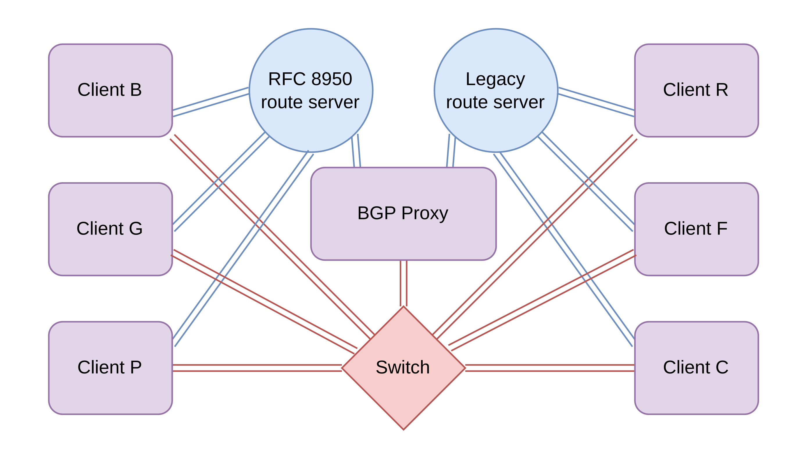
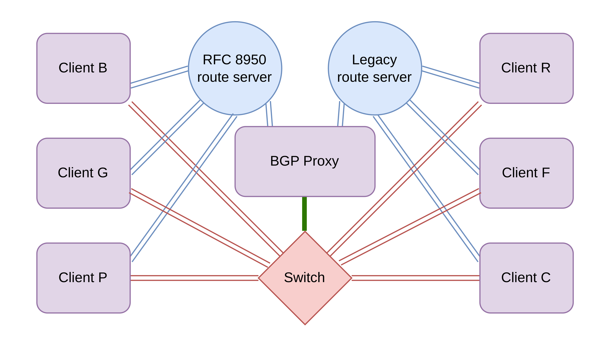
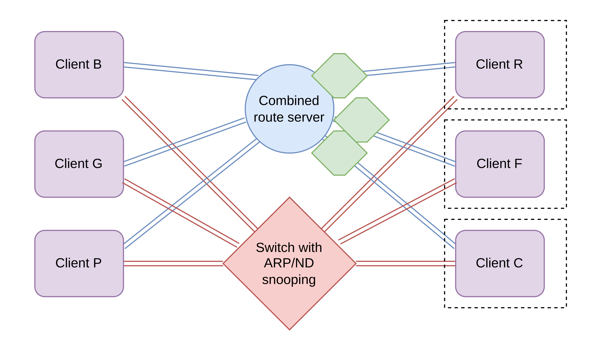

# RFC 8950 in route servers

- Legacy speakers
    - No support for RFC 8950
    - Need legacy prefices with legacy nexthops
    - Need not react to ND at all
- Supporting speakers
    - May send and receive legacy prefices with IPv6 nexthops
    - Must keep legacy sessions
    - Still need IPv4 addresses

# RFC 8950 in route servers

**Can't use RFC 8950 directly for removing  
IPv4 addresses from the route server.**

No motivation for actual deployment.  

*We also need a transitional mechanism, so that  
clients can be transferred one by one.*

# The Physical proxy way (this draft, sec. 5.4)

- Setup two domains (legacy / RFC8950)
- Setup a BGP / Add-Path scrubbing next hops to itself
- Setup a physical proxy handling the traffic
- Needs to send all traversing data through the proxies
- Allows gradually shrinking the IPv4 allocation
- Possible scaling problems

*This would be just an Informational RFC.*

# The Physical proxy way (this draft, sec. 5.4)

{ width=85% }

# The Virtual proxy way (this draft, sec. 5.4)

- Setup two domains (legacy / RFC8950)
- Setup a BGP/Add-Path translating next hops
- Setup an ARP/ND spoofer (!) replying on behalf of the clients
- Needs registering MAC of every client
- Needs an IPv4 assigned to every client

# The Virtual proxy way (this draft, sec. 5.4)

{ width=85% }

# The Edge mini-proxy way (most of this draft)

- One domain only, running on IPv6 nexthops
- Translating ARP/ND on edges  
  → access switch knows all machines
- Translating BGP next hops on import/export
- Needs registering MAC of every client
- Still needs an IPv4 assigned to every client

# The Edge mini-proxy way (most of this draft)

{ width=85% }

# Route server renumbering

- Obtaining larger IPv4 prefices is hard
- Renumbering is laborous
- The route server prefix is never actually routed in BGP
- Appears in IGP as prefix, and in iBGP as next hop
- Currently uses public ranges
- Alternative: private ranges → may clash with internal 

# Allocation request from 240/4

- The route server prefix is weird
- This is not "repurposing for unicast"
- Goal: Split out this next hop space
- Goal: Only one more renumbering to happen.

This can be also interpreted as a multi-node variant of  
[`draft-vanmook-intarea-ipv6-resolved-gateway`](https://datatracker.ietf.org/doc/draft-vanmook-intarea-ipv6-resolved-gateway)

# State of the work

- We think it's done, and it fits the WG purpose  
  → we request WG adoption and continuation with the process
- It's already configurable with BIRD with no code change
- We expect to look into other implementations
- The allocation request may be a friction point  
  *but we think it's reasonable*
